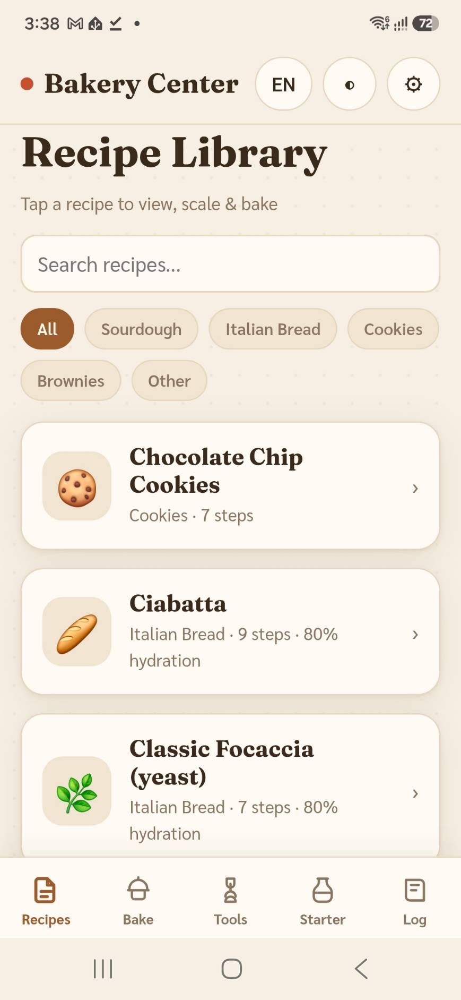
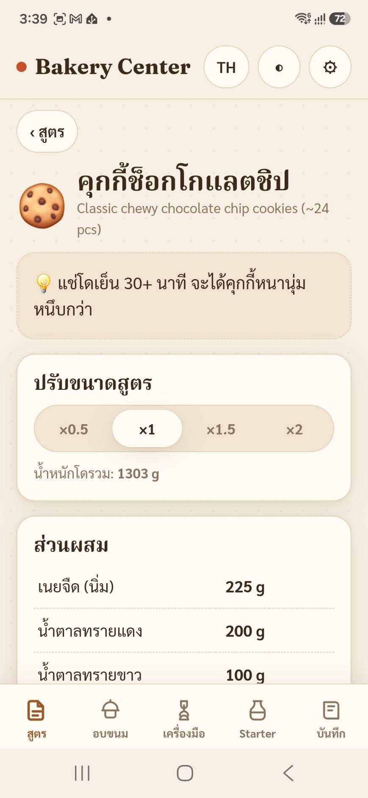
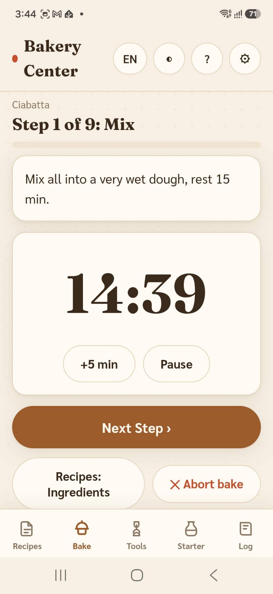
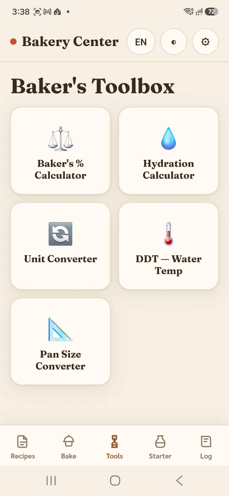
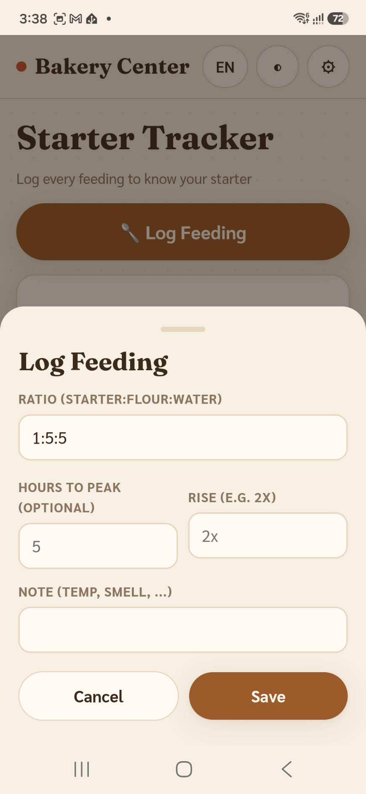
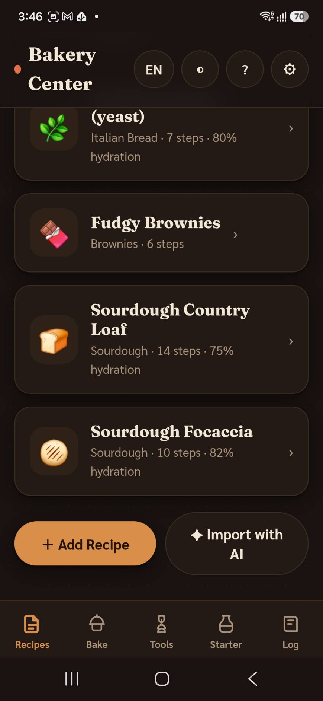

# Bakery Center — Features / ความสามารถของแอป

แอป companion สำหรับคนทำเบเกอรี่ที่บ้าน · ใช้บนมือถือในครัวจริง · ไม่มี login ไม่มี server ข้อมูลอยู่ในเครื่อง 100%
🔗 https://p2544.github.io/bakery-center/

---

## 📸 Screenshots

<table>
  <tr>
    <td align="center"> <b>Recipe Library</b> คลังสูตร</td>
    <td align="center"> <b>Scale &amp; baker's %</b> ปรับขนาดสูตร</td>
    <td align="center"> <b>Guided baking timer</b> โหมดเริ่มอบ</td>
  </tr>
  <tr>
    <td align="center"> <b>Baker's tools</b> เครื่องมือ 5 ตัว</td>
    <td align="center"> <b>Starter tracker</b> ตัวจด Starter</td>
    <td align="center"> <b>Dark mode</b> โหมดมืด</td>
  </tr>
</table>

---

## 🇹🇭 ภาษาไทย

### 📚 คลังสูตร (Recipes)
- เก็บสูตรขนมปัง / คุกกี้ / บราวนี่ ไม่จำกัดจำนวน พร้อมสูตรตัวอย่างให้ 6 สูตร
- ค้นหาสูตร และกรองตามหมวด (Sourdough, ขนมปังอิตาเลียน, คุกกี้, บราวนี่, อื่นๆ)
- หน้ารายละเอียดสูตรคำนวณให้อัตโนมัติ: **baker's %**, **hydration** (รวมน้ำใน starter ให้ด้วย), น้ำหนักโดรวม
- **ปรับขนาดสูตร** ได้ทันที — กดตัวคูณ ×0.5 / ×1 / ×1.5 / ×2 หรือกรอกน้ำหนักแป้งที่ต้องการ แล้วส่วนผสมทุกตัวปรับตาม
- เพิ่ม / แก้ไข / คัดลอก / ลบสูตรเองได้

### ✦ เพิ่มสูตรด้วย AI (AI Import)
- ก๊อป prompt จากแอป → วางในแชต AI ตัวไหนก็ได้ (Claude / ChatGPT / Gemini) พร้อมข้อความสูตร
- AI แปลงสูตรเป็นรูปแบบของแอปให้ (แปลงหน่วย cup เป็นกรัมอัตโนมัติ) → ก๊อป JSON กลับมาวาง เสร็จ

### 🔥 โหมดเริ่มอบ (Guided Baking)
- พาทำ **ทีละขั้น** มีแถบ progress บอกความคืบหน้า
- **จับเวลาอัตโนมัติทุกขั้น** ตัวเลขใหญ่อ่านง่าย + **เสียงระฆังและสั่นเตือน** เมื่อครบเวลา (นับเกินเวลาต่อให้เห็น)
- ปุ่ม Pause / ทำต่อ / +5 นาที / ข้าม / ยกเลิก
- **เวลาแม่นยำแม้สลับไปแอปอื่นหรือจอดับ** (คำนวณจากเวลาจริง ไม่ใช่นับถอยหลังในแอป)
- **หน้าจอไม่ดับระหว่างอบ** (มือเปื้อนแป้งไม่ต้องคอยปลุกจอ)
- **ปิดแอปแล้วกลับมาทำต่อได้** จากขั้นที่ค้างไว้
- อบเสร็จ เปิดหน้าบันทึกผลให้อัตโนมัติ

### 🧰 เครื่องมือ 5 ตัว (Tools)
- **Baker's % Calculator** — ใส่แป้ง + % ของแต่ละส่วนผสม คำนวณกรัมและน้ำหนักโดรวม
- **Hydration Calculator** — คำนวณ % น้ำในสูตร รวมน้ำที่อยู่ใน starter ให้ถูกต้อง
- **แปลงหน่วย (Unit Converter)** — cup / tbsp / tsp / oz เป็นกรัม (แยกตามชนิดวัตถุดิบ) + แปลงอุณหภูมิ °F ↔ °C
- **DDT — อุณหภูมิน้ำ** — คำนวณว่าควรใช้น้ำกี่องศาเพื่อให้โดได้อุณหภูมิที่ต้องการ
- **แปลงขนาดถาด (Pan Converter)** — บอกว่าต้องคูณสูตรเท่าไหร่เมื่อเปลี่ยนขนาด/รูปทรงถาด

### 🫙 ตัวจดการ Sourdough Starter
- กดบันทึกทุกครั้งที่ให้อาหาร (ratio, กี่ชม.ถึง peak, ขึ้นกี่เท่า, โน้ต)
- การ์ดบอก "ให้อาหารล่าสุดกี่ชม.ที่แล้ว" + ไทม์ไลน์ประวัติทั้งหมด

### 📓 สมุดบันทึกการอบ (Bake Log)
- บันทึกผลแต่ละครั้ง: ให้ดาว 1–5, เขียนโน้ต (อะไรดี อะไรต้องปรับ), แนบรูปได้สูงสุด 3 รูป
- รูปถูกย่อขนาดอัตโนมัติ ไม่ทำให้เครื่องเต็ม

### 💰 คำนวณต้นทุน (Cost)
- **สมุดราคาส่วนผสม** — ตั้งราคา ฿/กก. ของแต่ละวัตถุดิบครั้งเดียว ทุกสูตรนำไปใช้คำนวณให้อัตโนมัติ (มีปุ่มดึงชื่อส่วนผสมจากสูตรมาเติมให้)
- แต่ละสูตรแสดง **ต้นทุนรวม** และ **ต้นทุนต่อชิ้น** (ถ้าใส่จำนวนชิ้น) — ปรับตามขนาดที่ scale (×0.5–×2) อัตโนมัติ
- ใส่ราคาเฉพาะส่วนผสมในสูตรเดียวก็ได้ (override สมุดราคากลาง); น้ำคิดเป็นฟรี
- ราคาส่วนผสมถูกรวมในไฟล์ backup ด้วย

### ⚙️ ทั่วไป & ข้อมูล
- **2 ภาษา** ไทย / อังกฤษ สลับได้ทุกเมื่อ (คงศัพท์เทคนิคเบเกอรี่เป็นอังกฤษ)
- **โหมดมืด / สว่าง**
- **ใช้งานออฟไลน์ได้ 100%** หลังเปิดครั้งแรก
- **ติดตั้งลงหน้าจอโฮม** เปิดเต็มจอเหมือนแอปจริง (iPhone/Android)
- **สำรอง / กู้ข้อมูล** เป็นไฟล์เดียว (Export / Import JSON)
- **สำรองข้อมูลอัตโนมัติวันละครั้ง** — เปิดแอปครั้งแรกของวันแล้วไฟล์ backup จะดาวน์โหลดให้เอง
- ข้อมูลทุกอย่างเก็บในเครื่องคุณเอง — ไม่มี login ไม่มี server ไม่เก็บข้อมูลใคร เป็นส่วนตัวเต็มที่

---

## 🇬🇧 English

### 📚 Recipe Library
- Store unlimited bread / cookie / brownie recipes, with 6 sample recipes included.
- Search recipes and filter by category (Sourdough, Italian Bread, Cookies, Brownies, Other).
- The recipe detail page auto-calculates **baker's %**, **hydration** (correctly counting water inside the starter), and total dough weight.
- **Scale any recipe instantly** — tap ×0.5 / ×1 / ×1.5 / ×2 or type a target flour weight, and every ingredient adjusts.
- Add / edit / duplicate / delete your own recipes.

### ✦ Add Recipes with AI (AI Import)
- Copy the built-in prompt → paste it into any AI chat (Claude / ChatGPT / Gemini) along with a recipe.
- The AI converts it into the app's format (cups → grams automatically) → paste the JSON back and you're done.

### 🔥 Guided Baking Mode
- Walks you through **one step at a time** with a progress bar.
- **Built-in timer on every step** with a large readout + **bell sound and vibration** when time's up (and an overtime counter).
- Pause / Resume / +5 min / Skip / Abort controls.
- **Stays accurate even if you switch apps or the screen sleeps** (it uses real clock time, not an in-app countdown).
- **Keeps the screen awake while baking** — no need to tap with floury hands.
- **Close and resume** — pick up exactly where you left off.
- When you finish, it opens the bake-log entry automatically.

### 🧰 Five Calculators (Tools)
- **Baker's % Calculator** — enter flour + each ingredient's %, get grams and total dough weight.
- **Hydration Calculator** — compute the recipe's water %, correctly including the water in your starter.
- **Unit Converter** — cup / tbsp / tsp / oz to grams (per ingredient type) + °F ↔ °C temperature.
- **DDT — Water Temp** — calculates the water temperature needed to hit your target dough temperature.
- **Pan Size Converter** — tells you how much to scale a recipe when changing pan size or shape.

### 🫙 Sourdough Starter Tracker
- Log every feeding (ratio, hours to peak, how much it rose, notes).
- A card shows "last fed X hours ago" plus a full history timeline.

### 📓 Bake Log
- Record each bake: a 1–5 star rating, notes (what worked, what to change), and up to 3 photos.
- Photos are auto-resized so they don't fill up your device.

### 💰 Cost
- **Ingredient Prices book** — set the ฿/kg of each ingredient once and every recipe uses it automatically (a button pulls ingredient names from your recipes to fill the list).
- Each recipe shows its **total cost** and **cost per piece** (if you set a yield) — scaling automatically with the batch size (×0.5–×2).
- You can also set a price on a single ingredient inside one recipe (overrides the price book); water is counted as free.
- Ingredient prices are included in the backup file.

### ⚙️ General & Data
- **Two languages** — Thai / English, switch anytime (technical baking terms kept in English).
- **Dark / Light mode.**
- **Works 100% offline** after the first load.
- **Install to your home screen** and run full-screen like a real app (iPhone/Android).
- **Backup / restore** as a single file (Export / Import JSON).
- **Automatic daily backup** — a backup file downloads itself the first time you open the app each day.
- All data stays on your own device — no login, no server, nothing collected. Fully private.

---

## 📬 ติดต่อผู้พัฒนา / Contact

มีข้อเสนอแนะ อยากให้ปรับปรุงแก้ไข หรือพบข้อผิดพลาด? ติดต่อได้ที่:
*Have a suggestion, a request, or found a bug? Get in touch:*

- **ผู้พัฒนา / Developer:** p2544
- **Email:** piriya2544@gmail.com
